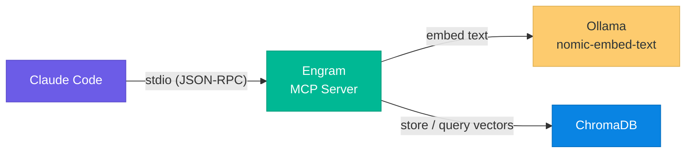
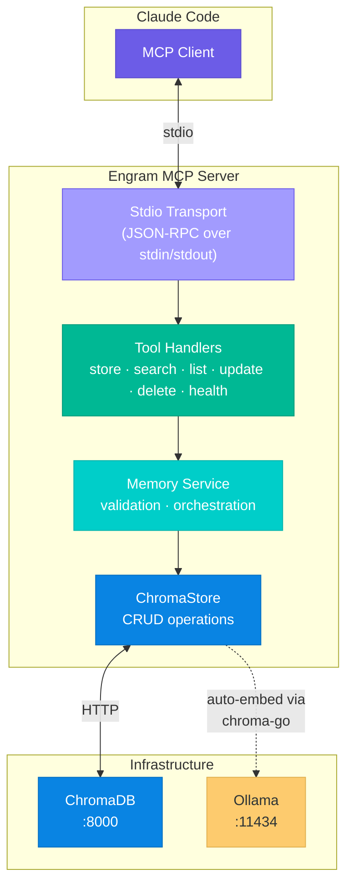
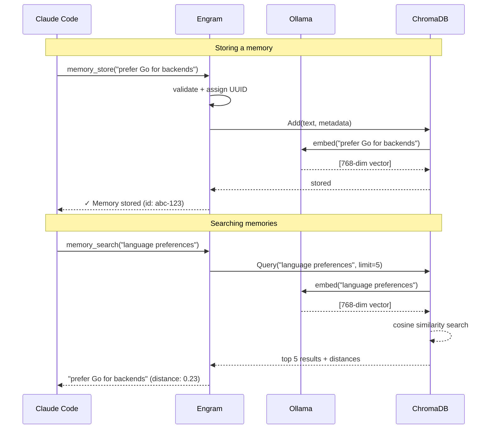

# Engram

**Persistent semantic memory for Claude Code, powered by vector search.**

Engram is an MCP (Model Context Protocol) server written in Go that gives Claude Code long-term memory across sessions. It stores, embeds, and retrieves memories using semantic similarity — so Claude can remember your preferences, decisions, project context, and patterns without you repeating yourself.

```
You: "Remember that I prefer Go for backend services and always use table-driven tests."
Claude: ✓ Stored.

— three weeks later, new session —

You: "What testing approach should I use here?"
Claude: (searches memory) → "You prefer table-driven tests. Let me structure these that way."
```

---

## How It Works



When Claude stores a memory, Engram sends the text to Ollama for embedding, then persists the vector + metadata in ChromaDB. When Claude searches, the query is embedded the same way and ChromaDB finds the most semantically similar memories — not keyword matching, but meaning matching.

---

## Architecture



---

## Data Flow



---

## MCP Tools

| Tool | Description |
|------|-------------|
| `memory_store` | Save a new memory with optional category, tags, and source context |
| `memory_search` | Semantic search — find memories by meaning, not keywords |
| `memory_list` | Browse memories with category/tag filters and pagination |
| `memory_update` | Update content, category, or tags (re-embeds automatically) |
| `memory_delete` | Remove a memory by ID |
| `health_check` | Verify ChromaDB + Ollama connectivity and memory count |

### Categories

Memories are organized into five categories:

| Category | Use Case |
|----------|----------|
| `preference` | Coding style, tool choices, formatting rules |
| `project` | Project-specific context, stack decisions, repo structure |
| `pattern` | Recurring solutions, architectural patterns, idioms |
| `decision` | Why something was chosen over alternatives |
| `fact` | General knowledge, references, credentials (non-secret) |

---

## Prerequisites

- **Go 1.21+**
- **Docker** + Docker Compose
- **Ollama** — install via `brew install ollama` (macOS) or [ollama.com](https://ollama.com)
- **Claude Code** CLI

---

## Quick Start

### 1. Start infrastructure

```bash
# Start ChromaDB
make infra

# Pull the embedding model (one-time)
ollama pull nomic-embed-text
```

### 2. Build and install

```bash
make install
```

This compiles the binary and copies it to `~/.local/bin/claude-memory-server`.

### 3. Register with Claude Code

```bash
claude mcp add claude-memory -- ~/.local/bin/claude-memory-server
```

### 4. Verify

Open Claude Code and try:

```
> Check memory system health
```

You should see ChromaDB and Ollama both reporting `ok`.

---

## Usage Examples

```
# Store memories
> Remember that I always use conventional commits
> Remember that this project uses PostgreSQL 16 with pgvector

# Search by meaning
> What database am I using?
> What are my commit conventions?

# Browse
> List all my preference memories
> Show me project-related memories

# Manage
> Update memory <id> to include that I also use Redis for caching
> Delete memory <id>
```

---

## Configuration

All settings are configurable via environment variables:

| Variable | Default | Description |
|----------|---------|-------------|
| `CHROMA_URL` | `http://localhost:8000` | ChromaDB server URL |
| `OLLAMA_URL` | `http://127.0.0.1:11434` | Ollama API URL |
| `OLLAMA_MODEL` | `nomic-embed-text` | Embedding model (768 dimensions) |
| `COLLECTION_NAME` | `claude_memories` | ChromaDB collection name |

To use custom values, set them before running, or configure in your Claude Code MCP settings:

```bash
claude mcp add claude-memory -- env CHROMA_URL=http://my-chroma:8000 ~/.local/bin/claude-memory-server
```

---

## Project Structure

```
engram/
├── cmd/claude-memory-server/
│   └── main.go                    # Entry point — wires deps, starts stdio server
├── internal/
│   ├── config/config.go           # Environment variable loading
│   ├── embedder/ollama.go         # Ollama embedding function wrapper
│   ├── chromastore/store.go       # ChromaDB operations (implements Store interface)
│   ├── memory/
│   │   ├── types.go               # Memory struct, Store interface, request/response types
│   │   └── service.go             # Business logic, validation, orchestration
│   └── tools/
│       ├── register.go            # Bulk tool registration
│       ├── memory_store.go        # memory_store handler
│       ├── memory_search.go       # memory_search handler
│       ├── memory_list.go         # memory_list handler
│       ├── memory_delete.go       # memory_delete handler
│       ├── memory_update.go       # memory_update handler
│       └── health_check.go        # health_check handler
├── docker-compose.yml             # ChromaDB container
├── Makefile                       # Build, install, test, infra targets
├── go.mod
└── go.sum
```

---

## Makefile Targets

| Target | Description |
|--------|-------------|
| `make build` | Compile the binary |
| `make install` | Build + copy to `~/.local/bin` |
| `make test` | Run all tests |
| `make infra` | Start ChromaDB via Docker Compose |
| `make infra-down` | Stop ChromaDB |
| `make register` | Show Claude Code registration command |
| `make clean` | Remove built binary |

---

## Tech Stack

| Component | Role |
|-----------|------|
| [Go](https://go.dev) | Server language |
| [mcp-go](https://github.com/mark3labs/mcp-go) | MCP protocol implementation (stdio transport) |
| [ChromaDB](https://www.trychroma.com) | Vector database for storage and similarity search |
| [chroma-go](https://github.com/amikos-tech/chroma-go) | Go client for ChromaDB (handles auto-embedding) |
| [Ollama](https://ollama.com) | Local embedding model runtime |
| [nomic-embed-text](https://ollama.com/library/nomic-embed-text) | 768-dimension embedding model |

---

## Design Decisions

- **All local** — No cloud APIs, no data leaves your machine. Ollama runs embeddings locally, ChromaDB stores vectors on disk.
- **Auto-embedding** — chroma-go's built-in Ollama integration means the server passes text, not vectors. Embedding happens transparently on add and query.
- **Single collection** — All memories live in `claude_memories` with category as a metadata filter, keeping the data model simple.
- **Interface-driven store** — The `memory.Store` interface decouples business logic from ChromaDB, enabling future database swaps or mock-based testing.
- **Errors via MCP** — Tool handlers return `mcp.NewToolResultError()`, never Go-level errors, so Claude always gets a readable message.
- **Stderr-only logging** — stdout is reserved exclusively for MCP JSON-RPC; all logs go to stderr.

---

## Name Alternatives

The suggested name for this project is **Engram** — a neuroscience term meaning *a persistent memory trace stored in the brain*. Other candidates considered:

| Name | Origin |
|------|--------|
| **Engram** | A memory trace in the brain (recommended) |
| **Mnemos** | Greek root *mneme* (memory), origin of "mnemonic" |
| **Cortex** | The brain region responsible for memory and reasoning |
| **Synaptic** | Relating to synapses — the connections that form memories |

---

## License

MIT
