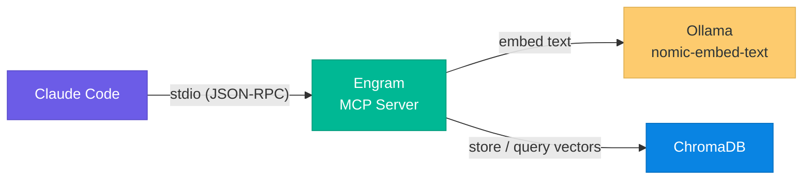
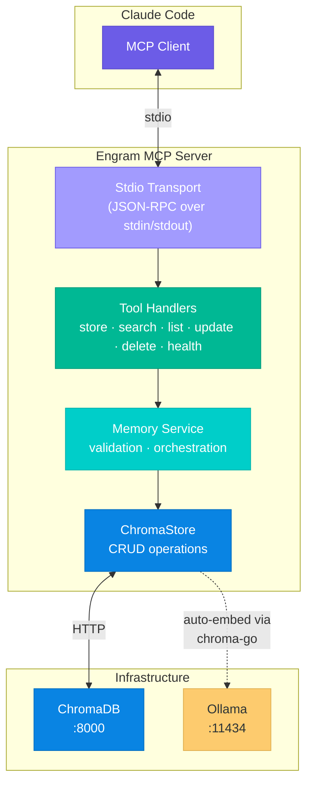
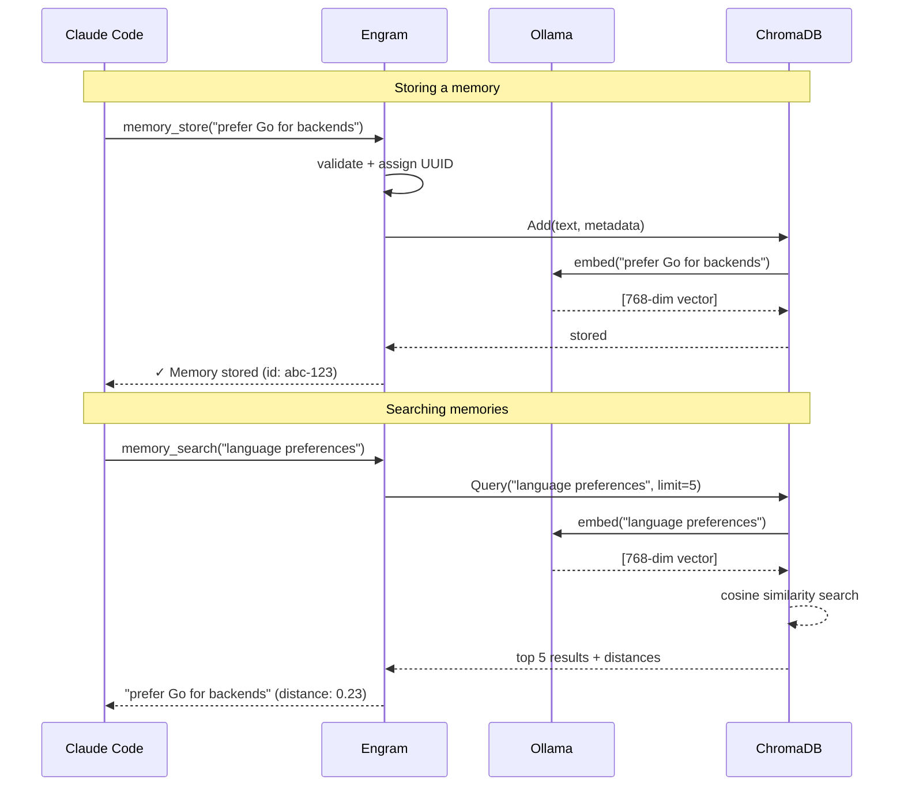

# Engram

**Persistent semantic memory for Claude Code, powered by vector search.**

Engram is an MCP (Model Context Protocol) server written in Go that gives Claude Code long-term memory across sessions. It stores, embeds, and retrieves memories using semantic similarity — so Claude can remember your preferences, decisions, project context, and patterns without you repeating yourself.

```
You: "Remember that I prefer Go for backend services and always use table-driven tests."
Claude: ✓ Stored.

— three weeks later, new session —

You: "What testing approach should I use here?"
Claude: (searches memory) → "You prefer table-driven tests. Let me structure these that way."
```

---

## How It Works



When Claude stores a memory, Engram sends the text to Ollama for embedding, then persists the vector + metadata in ChromaDB. When Claude searches, the query is embedded the same way and ChromaDB finds the most semantically similar memories — not keyword matching, but meaning matching.

---

## Architecture



---

## Data Flow



---

## MCP Tools

| Tool | Description |
|------|-------------|
| `memory_store` | Save a new memory with optional category, tags, and source context |
| `memory_search` | Semantic search — find memories by meaning, not keywords |
| `memory_list` | Browse memories with category/tag filters and pagination |
| `memory_update` | Update content, category, or tags (re-embeds automatically) |
| `memory_delete` | Remove a memory by ID |
| `health_check` | Verify ChromaDB + Ollama connectivity and memory count |

### Categories

Memories are organized into five categories:

| Category | Use Case |
|----------|----------|
| `preference` | Coding style, tool choices, formatting rules |
| `project` | Project-specific context, stack decisions, repo structure |
| `pattern` | Recurring solutions, architectural patterns, idioms |
| `decision` | Why something was chosen over alternatives |
| `fact` | General knowledge, references, credentials (non-secret) |

---

## Prerequisites

- **Go 1.21+**
- **Docker** + Docker Compose
- **Ollama** — install via `brew install ollama` (macOS) or [ollama.com](https://ollama.com)
- **Claude Code** CLI

---

## Quick Start

### 1. Start infrastructure

```bash
# Start ChromaDB
make infra

# Pull the embedding model (one-time)
ollama pull nomic-embed-text
```

### 2. Build and install

```bash
make install
```

This compiles the binary and copies it to `~/.local/bin/claude-memory-server`.

### 3. Register with Claude Code

```bash
claude mcp add claude-memory -- ~/.local/bin/claude-memory-server
```

### 4. Verify

Open Claude Code and try:

```
> Check memory system health
```

You should see ChromaDB and Ollama both reporting `ok`.

---

## Usage Examples

```
# Store memories
> Remember that I always use conventional commits
> Remember that this project uses PostgreSQL 16 with pgvector

# Search by meaning
> What database am I using?
> What are my commit conventions?

# Browse
> List all my preference memories
> Show me project-related memories

# Manage
> Update memory <id> to include that I also use Redis for caching
> Delete memory <id>
```

---

## Automatic memory (Claude Code hooks)

Beyond the MCP tools (which Claude calls deliberately), Engram ships Claude Code hooks that make memory recall and capture *automatic*, via the `engram` CLI (`cmd/engram`) — a stdio-driven front-end to the same memory service, built for scripting rather than conversation.

| Hook | Trigger | What it does |
|------|---------|--------------|
| `hooks/engram-recall.sh` | `UserPromptSubmit` | Searches memory for the incoming prompt and, if relevant memories clear the distance threshold, injects them as context before Claude sees the prompt. Strips IDE/system noise blocks (`<ide_opened_file>`, `<system-reminder>`, etc.) out of the prompt first — those used to get embedded verbatim, which is not what you want to search on. Skips silently on short prompts (<20 chars after cleaning), slash commands, or any internal error. |
| `hooks/engram-capture.sh` | `SessionEnd` | Sends the session transcript to the self-hosted Qwen gateway, asks it to extract 0–5 durable memories (preferences, decisions, patterns, facts — never task minutiae or secrets), and stores whatever qualifies. Redacts likely secrets from the transcript text before it ever leaves the box (see below). Logs every decision to `~/.claude/logs/engram-capture.log`; produces no stdout. |
| `hooks/engram-capture-cron.sh` | cron, e.g. every 6h | Incremental backstop for the hook above — see [Why not just SessionEnd?](#why-not-just-sessionend) |
| `hooks/engram-backup.sh` | cron, e.g. weekly | Tars up the ChromaDB data volume to `~/backups/engram/`, keeping the newest 8 |

All four scripts are defensive by design: they depend only on `jq`/`curl`/`perl`/coreutils, bound every network call with `timeout`, and always exit `0` so a broken hook (or cron job) can never block Claude Code or pile up failure emails.

Install them with:

```bash
make install-hooks
```

This copies the scripts to `~/.claude/hooks/` and prints the suggested crontab lines for the two cron scripts — it does **not** register or schedule anything itself. Wire up the Claude Code hooks yourself in `~/.claude/settings.json`:

```json
{
  "hooks": {
    "UserPromptSubmit": [{ "hooks": [{ "type": "command", "command": "~/.claude/hooks/engram-recall.sh" }] }],
    "SessionEnd": [{ "hooks": [{ "type": "command", "command": "~/.claude/hooks/engram-capture.sh" }] }]
  }
}
```

...and add the cron scripts yourself via `crontab -e`:

```cron
17 */6 * * * $HOME/.claude/hooks/engram-capture-cron.sh
43 3 * * 0   $HOME/.claude/hooks/engram-backup.sh
```

### Why not just SessionEnd?

`engram-capture.sh` only runs when Claude Code fires `SessionEnd` — and in practice, plenty of sessions never end cleanly (killed terminal, closed laptop lid, OOM, a crashed `tmux` pane). Observed on this VPS: 32 `SessionEnd` skips logged, 0 real captures, because none of those sessions triggered the hook at all. `engram-capture-cron.sh` decouples capture from session lifecycle: on a cron schedule, it scans transcripts modified in the last 7 days under `~/.claude/projects` (overridable via `ENGRAM_PROJECTS_DIR`, e.g. for tests), tracks how many lines of each it has already processed in `~/.local/state/engram/capture-offsets.tsv`, and feeds only the *new* tail of each transcript into `engram-capture.sh` once it has accumulated at least 8 new user/assistant lines (below that, it waits rather than firing on scraps — and does **not** advance its offset, so those lines aren't silently dropped, just deferred to the next run). It excludes subagent transcripts, caps itself at 5 transcripts per run, and uses `flock` so overlapping cron runs can't stack up.

### Redaction

`engram-capture.sh` sends transcript text to an external gateway (the self-hosted Qwen instance), so before that request is built, the extracted conversation text is run through a best-effort secret-masking pass (`redact_secrets` in the script): AWS access keys, GitHub/OpenAI/Anthropic/service tokens, `Bearer` tokens, generic `key: value` / `password=...`-shaped assignments, PEM private-key blocks, and bare 40+ char hex strings are all replaced with `[REDACTED]`. The patterns mirror `~/.claude/scripts/secret-scan.sh`'s credential set where applicable. This deliberately over-redacts sometimes (e.g. a long hex commit SHA isn't actually a secret) — for text leaving the machine, masking too much is the safer failure mode.

### Backup

`engram-backup.sh` tars up the ChromaDB Docker volume (`engram_chroma_data`) to `~/backups/engram/chroma-<timestamp>.tar.gz` and prunes to the newest 8. It's a **live-file** copy — no write-freeze or snapshot around the `tar` — so there's a small torn-copy risk if it runs mid-write; acceptable here since engram is a low-write store (memories are stored one at a time, not in bulk) and, even in the unlucky case, the previous backups are still around. Skips gracefully (logs and exits 0) if `docker` or the volume isn't present.

### `engram` CLI

| Command | Description |
|---------|-------------|
| `engram recall [-limit N] [-threshold F] [-source S] <query...>` | Semantic search, re-ranked by recency and source match; prints one `- [category] content (tags: ...; source: ...; age)` line per hit, nothing if none clear the threshold. Skips the embed+search round trip entirely (and prints nothing) when the store is empty |
| `engram store [-category C] [-tags a,b] [-source S] <content...>` | Stores a memory (dedup applies); prints `stored <id>` or `merged into <id>` |
| `engram delete <id>` | Deletes a memory; prints `deleted <id>` |
| `engram list [-category C] [-tags a,b] [-limit N] [-offset N]` | Lists memories, one `<id>  [category] content (tags: ...; source: ...; age)` line per row; default limit 20, max 50; nothing printed when there are no matches |
| `engram stats` | Prints total/per-category/per-source memory counts and oldest/newest timestamps (paging through the store internally, capped at 1000), plus — if `~/.claude/logs/engram-recall.log` exists — the recall hook's real-world fire rate (overall and last 7 days) |
| `engram health` | Reports ChromaDB/Ollama status and memory count; exits non-zero if either is unhealthy |

stdout is kept machine-clean on every subcommand — diagnostics always go to stderr — because `engram recall`'s output is injected straight into an LLM's context by the recall hook.

### Env knobs

| Variable | Default | Description |
|----------|---------|-------------|
| `ENGRAM_RECALL_LIMIT` | `3` | Max memories the recall hook injects per prompt |
| `ENGRAM_RECALL_THRESHOLD` | `0.42` | Max raw cosine distance the recall hook will consider. Re-benchmarked after switching to nomic-embed-text's `search_document:`/`search_query:` prefixes (see [Design Decisions](#design-decisions)) — prefixing shifts every distance, so the old 0.48 default no longer means the same thing. Measured related-query distances span 0.28–0.41 (held-out paraphrases sit at the top of that band), while unrelated prompts bottom out anywhere from ~0.36 (diverse store) to ~0.45 (small store) — the bands overlap, so no scalar threshold is clean. `0.42` deliberately favors recall: a missed memory silently forfeits the system's whole value, while a false positive costs ~3 clearly-labeled lines the model can ignore. Set `0.35` for precision mode (fewest false positives, but misses paraphrased prompts) |
| `DEDUP_THRESHOLD` | `0.15` | Max cosine distance for `Service.Store` to treat a new memory as a duplicate and merge instead of insert (see [Design Decisions](#design-decisions)); `0` disables dedup. Re-measured post-prefix-change against 4 EN/ID paraphrase pairs (distances 0.02-0.24, all must merge) and 3 related-but-distinct pairs (distances 0.19, 0.39, 0.41, must not merge) — `0.15` is deliberately conservative: a false merge silently *overwrites* a distinct memory (one measured distinct pair sits at 0.19, inside the paraphrase band), while a missed merge just leaves a harmless duplicate that offline consolidation can clean up later. The asymmetry favors under-merging, so the default stays below the closest measured distinct pair with margin; paraphrase pairs at 0.02–0.11 still merge, looser ones (0.20–0.24) intentionally do not |

---

## Configuration

All settings are configurable via environment variables:

| Variable | Default | Description |
|----------|---------|-------------|
| `CHROMA_URL` | `http://localhost:8000` | ChromaDB server URL |
| `OLLAMA_URL` | `http://127.0.0.1:11434` | Ollama API URL |
| `OLLAMA_MODEL` | `nomic-embed-text` | Embedding model (768 dimensions) |
| `COLLECTION_NAME` | `claude_memories` | ChromaDB collection name |
| `DEDUP_THRESHOLD` | `0.15` | Cosine-distance threshold for merging near-duplicate memories on store; `0` disables |

To use custom values, set them before running, or configure in your Claude Code MCP settings:

```bash
claude mcp add claude-memory -- env CHROMA_URL=http://my-chroma:8000 ~/.local/bin/claude-memory-server
```

---

## Project Structure

```
engram/
├── cmd/
│   ├── claude-memory-server/
│   │   └── main.go                # Entry point — wires deps, starts stdio MCP server
│   └── engram/
│       ├── main.go                # CLI entry point — recall/store/delete/list/stats/health subcommands
│       └── main_test.go           # agePenalty/humanizeAge/formatRecallLine unit tests
├── internal/
│   ├── config/config.go           # Environment variable loading
│   ├── embedder/ollama.go         # Ollama embedding function wrapper (adds nomic-embed-text's asymmetric prefixes)
│   ├── chromastore/store.go       # ChromaDB operations (implements Store interface)
│   ├── memory/
│   │   ├── types.go               # Memory struct, Store interface, request/response types
│   │   ├── service.go             # Business logic, validation, dedup/supersede, orchestration
│   │   └── service_test.go        # Service unit tests against a mockStore
│   └── tools/
│       ├── register.go            # Bulk tool registration
│       ├── memory_store.go        # memory_store handler
│       ├── memory_search.go       # memory_search handler
│       ├── memory_list.go         # memory_list handler
│       ├── memory_delete.go       # memory_delete handler
│       ├── memory_update.go       # memory_update handler
│       └── health_check.go        # health_check handler
├── hooks/
│   ├── engram-recall.sh           # UserPromptSubmit hook — auto-injects relevant memories
│   ├── engram-capture.sh          # SessionEnd hook — extracts + stores memories via Qwen gateway
│   ├── engram-capture-cron.sh     # cron backstop — incremental capture independent of SessionEnd
│   └── engram-backup.sh           # cron job — tars up the ChromaDB volume, prunes to newest 8
├── docker-compose.yml             # ChromaDB container
├── Makefile                       # Build, install, test, infra, hooks targets
├── go.mod
└── go.sum
```

---

## Makefile Targets

| Target | Description |
|--------|-------------|
| `make build` | Compile both `claude-memory-server` and `engram` |
| `make install` | Build + copy both binaries to `~/.local/bin` |
| `make install-hooks` | Copy `hooks/*.sh` to `~/.claude/hooks/` and print suggested crontab lines (does not register the Claude Code hooks or touch crontab itself) |
| `make test` | Run all tests |
| `make infra` | Start ChromaDB via Docker Compose |
| `make infra-down` | Stop ChromaDB |
| `make register` | Show Claude Code registration command |
| `make clean` | Remove built binaries |

---

## Tech Stack

| Component | Role |
|-----------|------|
| [Go](https://go.dev) | Server language |
| [mcp-go](https://github.com/mark3labs/mcp-go) | MCP protocol implementation (stdio transport) |
| [ChromaDB](https://www.trychroma.com) | Vector database for storage and similarity search |
| [chroma-go](https://github.com/amikos-tech/chroma-go) | Go client for ChromaDB (handles auto-embedding) |
| [Ollama](https://ollama.com) | Local embedding model runtime |
| [nomic-embed-text](https://ollama.com/library/nomic-embed-text) | 768-dimension embedding model |

---

## Design Decisions

- **All local** — No cloud APIs, no data leaves your machine. Ollama runs embeddings locally, ChromaDB stores vectors on disk.
- **Auto-embedding** — chroma-go's built-in Ollama integration means the server passes text, not vectors. Embedding happens transparently on add and query.
- **Single collection** — All memories live in `claude_memories` with category as a metadata filter, keeping the data model simple.
- **Interface-driven store** — The `memory.Store` interface decouples business logic from ChromaDB, enabling future database swaps or mock-based testing.
- **Dedup/supersede on store** — `Service.Store` runs a best-effort nearest-neighbor search before inserting; if the closest existing memory is within `DEDUP_THRESHOLD` cosine distance, it's updated in place (content replaced, tags unioned, source kept unless overridden) instead of creating a near-duplicate. This makes repeated auto-capture of the same fact idempotent rather than noisy. A failed dedup lookup never blocks the store — it just falls back to a normal insert. Note that the lookup is global (no category/tag filter), so in rare cases a closely-related-but-distinct memory can still land inside the dedup band — see the [`DEDUP_THRESHOLD` knob](#env-knobs) for a concrete example found during benchmarking.
- **nomic-embed-text task prefixes** — nomic-embed-text is an *asymmetric* embedding model: it's trained expecting a `search_document: ` prefix on things you store and a `search_query: ` prefix on things you search with, and mixing them up measurably hurts retrieval quality. chroma-go's built-in Ollama embedding function sends raw text with neither prefix, so `internal/embedder/ollama.go` wraps it in a small `prefixedEF` (implements `embeddings.EmbeddingFunction`, embeds the real one, overrides only `EmbedDocuments`/`EmbedQuery`) that adds the right prefix at the right call site. This changes every cosine distance the store produces, which is why `ENGRAM_RECALL_THRESHOLD` and `DEDUP_THRESHOLD` both needed re-benchmarking after this change (see [Env knobs](#env-knobs)) — the old 0.48/0.2 defaults were calibrated against unprefixed embeddings and no longer mean the same thing.
- **Errors via MCP** — Tool handlers return `mcp.NewToolResultError()`, never Go-level errors, so Claude always gets a readable message.
- **Stderr-only logging** — stdout is reserved exclusively for MCP JSON-RPC; all logs go to stderr.

---

## Name Alternatives

The suggested name for this project is **Engram** — a neuroscience term meaning *a persistent memory trace stored in the brain*. Other candidates considered:

| Name | Origin |
|------|--------|
| **Engram** | A memory trace in the brain (recommended) |
| **Mnemos** | Greek root *mneme* (memory), origin of "mnemonic" |
| **Cortex** | The brain region responsible for memory and reasoning |
| **Synaptic** | Relating to synapses — the connections that form memories |

---

## License

MIT
